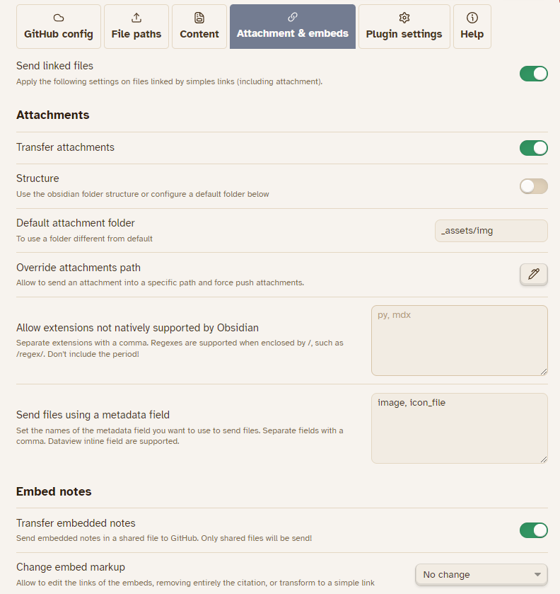
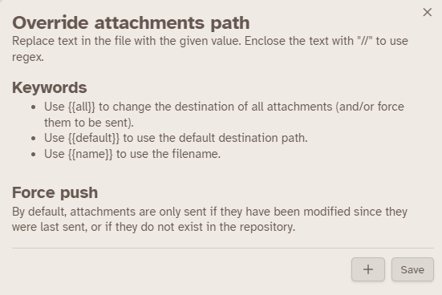

> [!NOTE]
> The first option allow you to share *also* the notes linked by a **simple** links, like `[[note]]` or `[note](note.md)`. Disable it and you needs to use a dataview query (or frontmatter property) to send specific files.
> Obviously, the notes needs to be shared to be send.


You can choose to send embedded files in two ways:

- <u>Attachments</u>: The file will be copied to the repository in an optional settled folder. Attachments are [all files supported by Obsidian (that aren't markdown)](https://help.obsidian.md/Files+and+folders/Accepted+file+formats).
- <u>Notes</u>: Only shared files will be copied in the repository, in their respected folder (following your settings).


## Attachments

By default, attachments are not overridden if they are already exists in the repository until they are edited (the date between the two are compared). This mean that the API will use between **one** and **three** token to check and send attachments. You can force push an attachmentu using `override attachment path` modal.

- <u>Structure</u> : Allow to use the Obsidian folder for attachments instead of a fixed folder.
- <u>Override attachments path</u> : Allow to change the path of a specific file (supporting regex) and force push an attachment. This can allow to send specific file into a specific folder **from roots**, **overriding all parameters**.
  

> [!example] > `/^_assets\/_PLUGINS\/icons\/(.*)\/(.*)\.svg$/` → `overrides/icons/$1/$2.svg` : Will send all `svg` file into the folder `overrides/icons`

Additionally, you can choose to send files based on a metadata field. This means that if a specific field in the file's frontmatter (or using a Inline Dataview) is set to a certain value, the file will be sent to the repository.

> [!example]
>
> ```
> ---
> banner: my_image.png
> ---
> ```
>
> If you set the metadata `banner`, the image will be sent to the default attachment folder. All attachments supported by Obsidian (plus Markdown files) are supported.
> This means that you can send images, pdfs, audio files and any other types of files that are supported by Obsidian and are embedded in your notes.

This feature allows you to easily share all the necessary resources in your notes with your remote repository.

## Embed notes

You can choose to send embedded note (in markdown)

You can also change the look of the embedded links, if you set the transfer of these note to true:

- "No change" : Will keep the original link, as in Obsidian ;
- "Remove link completely" will delete the citation completely and keep only the text ;
- "Transform to link" will remove the `!` before the link.
  Using this setting add a new option, where you can add something before the link. By default, it's `->`. So, you will have, as result: `![[link]]` to `-> [[link]]`
- "Include embeds contents" : Based on the [plugin easy-bake](https://github.com/mgmeyers/obsidian-easy-bake), the contents of the embed will be included as in, without markdown or html specificities. It supports block, heading, and entire file. Note that the embedded file will be send to the repository, as the option is mandatory. Note that your embedded file must be shared to be included.

> [!warning] Outside of a blog's solution that support file embedding, the content's of the embedded notes won't be added to your note.
> In these case, you can use `include embeds contents` option.

## Excalidraw files

Excalidraw files are not normally handled by Obsidian as default attachment, but the plugin will. The file will be converted automatically into svg files. Now, you don't need to embed the svg or png and use the default `.excalidraw` file.
